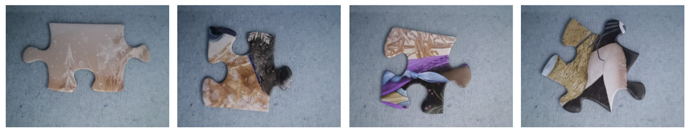
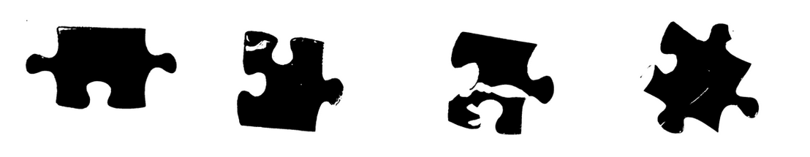

# Computer Vision Lab 3: Segmentation With Deep Learning

This project implements the **U-Net segmentation model** using PyTorch. We train, validate, and test the model on a small dataset of 10 training images and 4 images each for validation and testing. The performance of our custom U-Net implementation is then compared against pre-trained U-Net and **DeepLab V3+** models with various backbones, including **ResNet**, **Mobile V3**, and **EfficientNet**.

***

## Quickstart

To get started, follow these steps:

1.  **Create a virtual environment**: Run `make venv` to create a dedicated Python environment for the project. This ensures that dependencies are isolated.
2.  **Install dependencies**: Install all the required libraries by running `make install`.
3.  **Explore the results**: The experiments, results, and performance visualizations of all the models are displayed within the **`main.ipynb`** Jupyter notebook.

***

## Dependencies

The following dependencies are used in this project. Versions are provided to ensure compatibility.

- **numpy**: 2.2.6  
- **torch**: 2.8.0+cu126  
- **wandb**: 0.21.3  
- **matplotlib**: 3.10.0  
- **segmentation-models-pytorch**: 0.5.0  
- **torchvision**: 0.23.0+cu126  
- **opencv-python**: 4.12.0.88  
- **scikit-learn**: 1.6.1  

***

## Weights & Biases (W&B)

To simulate the experiments, you are required to have a wandb account for submitting model configuration details and logging metrics data during training.
**Weights & Biases (W&B)** is a powerful platform for tracking and visualizing machine learning experiments. In this project, we leverage W&B to monitor key metrics during the training process, including **training loss**, **validation loss**, and **validation IoU** (Intersection over Union). These metrics help us evaluate the performance of each segmentation model and compare them effectively. W&B provides interactive plots that make it easy to analyze the results and understand how the models are learning.